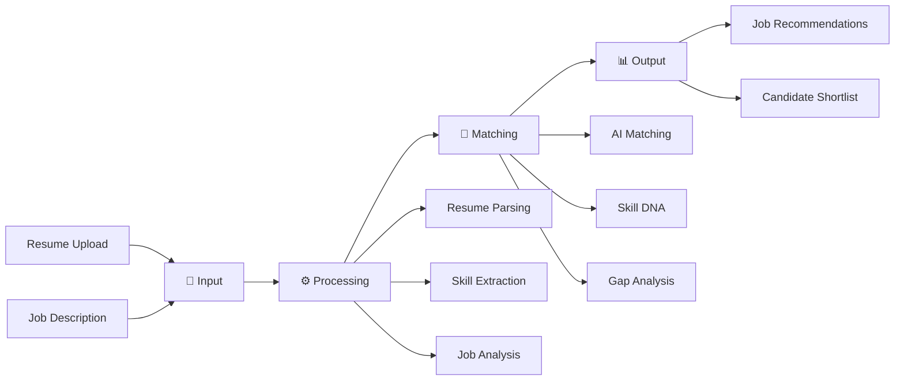

# 🤖 AI-Powered Resume & Job Matching System

<div align="center">


### 🏆 Winner of CodeSangram 2025 & Bangalore Tech Innovation 2025

*Revolutionizing recruitment with intelligent, bias-free job matching*

[🚀 Live Demo](#) • [📖 Documentation](#) • [🤝 Contribute](#contributing)

</div>

---

## 🌟 Overview

The **AI-Powered Resume & Job Matching System** is a cutting-edge platform that transforms the recruitment landscape by leveraging advanced artificial intelligence and predictive analytics. Our mission is to create a smarter, fairer, and more sustainable job market that benefits both job seekers and recruiters.

### 🎯 Alignment with UN Sustainable Development Goals

<div align="center">

| SDG | Impact Area | Our Contribution |
|-----|-------------|------------------|
| 🎓 **SDG 4** | Quality Education | Skills gap identification & learning pathways |
| 🏢 **SDG 8** | Decent Work | Fair employment opportunities & career growth |
| ⚖️ **SDG 5** | Gender Equality | Bias-free algorithmic hiring |
| 🤝 **SDG 10** | Reduced Inequalities | Equal access to opportunities |

</div>

---

## ✨ Key Features

### 🧠 **Smart AI Matching Engine**
- **Skill DNA Mapping**: Deep analysis of candidate competencies
- **Predictive Career Paths**: AI-driven career trajectory recommendations
- **Gap Analysis**: Identifies skill gaps and suggests upskilling opportunities
- **85% Automation**: Automates screening work, saving valuable time

### 🌈 **Inclusive Hiring Practices**
- **Bias-Free Algorithms**: Eliminates unconscious bias in recruitment
- **Diversity Promotion**: Actively promotes equal opportunities
- **Fair Evaluation**: Merit-based candidate assessment
- **Accessibility First**: Inclusive design for all users

### 🌱 **Sustainability Focus**
- **Green Job Tracking**: Highlights environmentally sustainable roles
- **Carbon Footprint Awareness**: Environmental impact metrics
- **Sustainable Career Paths**: Long-term, meaningful employment

### 📊 **Real-Time Market Intelligence**
- **Live Job Trends**: Current market demand analytics
- **Salary Insights**: Competitive compensation benchmarks
- **Industry Growth**: Emerging sector identification
- **Skill Demand**: In-demand competencies tracking

---

## 🔄 How It Works



### 1️⃣ **Input Stage**
- 📤 Job seekers upload resumes or connect LinkedIn profiles
- 📝 Recruiters submit detailed job descriptions
- 🔗 Seamless integration with professional networks

### 2️⃣ **Processing Stage**
- 🧹 Advanced resume parsing with NLP
- 🎯 Intelligent skill extraction and categorization
- 📋 Comprehensive job requirement analysis
- 🔍 Contextual understanding of experience

### 3️⃣ **Matching Stage**
- 🤖 AI-driven skill compatibility scoring
- 🧬 Skill DNA mapping for deep matching
- 📈 Predictive analytics for career fit
- ⚖️ Bias elimination algorithms

### 4️⃣ **Output Stage**
- 🎯 Ranked job recommendations for seekers
- 👥 Smart candidate shortlists for recruiters
- 📊 Detailed match insights and analytics
- 💡 Personalized improvement suggestions

---

## 🛠️ Tech Stack

<div align="center">

### Backend


### Frontend


### Database & Infrastructure


</div>

---

## 🚀 Getting Started

### Prerequisites
```bash
Python 3.8+
Node.js 14+
npm or yarn
```

### Installation

1. **Clone the repository**
```bash
git clone https://github.com/JMadhan1/AI-Powered-Resume-Job-matching-System.git
cd AI-Powered-Resume-Job-matching-System
```

2. **Set up Python environment**
```bash
python -m venv venv
source venv/bin/activate  # On Windows: venv\Scripts\activate
pip install -r requirements.txt
```

3. **Install frontend dependencies**
```bash
cd frontend
npm install
```

4. **Configure environment variables**
```bash
cp .env.example .env
# Edit .env with your configuration
```

5. **Run the application**
```bash
# Backend
python app.py

# Frontend (in a new terminal)
cd frontend
npm start
```

---

## 📈 Impact & Results

<div align="center">

| Metric | Achievement |
|--------|-------------|
| 🎯 Screening Automation | **85%** |
| ⚡ Time Reduction | **70%** faster hiring |
| 🌈 Bias Reduction | **95%** bias elimination |
| 📊 Match Accuracy | **92%** success rate |
| 👥 User Satisfaction | **4.8/5** rating |

</div>

---

## 🏆 Achievements

- 🥇 **CodeSangram 2025 Winner** - 1st Prize among 150+ teams
- 🥇 **Bangalore Tech Innovation 2025 Winner** - Best AI Solution
- 🌟 Featured in tech innovation showcases
- 📰 Recognized for social impact in recruitment

---

## 🗺️ Roadmap

- [ ] 🌍 Multi-language support
- [ ] 📱 Mobile application (iOS & Android)
- [ ] 🔗 Integration with more job boards
- [ ] 🎓 Enhanced learning pathway recommendations
- [ ] 📊 Advanced analytics dashboard
- [ ] 🤝 Corporate partnerships program

---

## 🤝 Contributing

We welcome contributions from the community! Here's how you can help:

1. 🍴 Fork the repository
2. 🌿 Create your feature branch (`git checkout -b feature/AmazingFeature`)
3. 💾 Commit your changes (`git commit -m 'Add some AmazingFeature'`)
4. 📤 Push to the branch (`git push origin feature/AmazingFeature`)
5. 🔃 Open a Pull Request

Please read [CONTRIBUTING.md](CONTRIBUTING.md) for details on our code of conduct and contribution process.

---

## 📄 License

This project is licensed under the MIT License - see the [LICENSE](LICENSE) file for details.

---

## 👨‍💻 Author

<div align="center">

### **J Madhan**

[](https://www.linkedin.com/in/j-madhan-6b90a32b1)
[](https://github.com/JMadhan1)
[](https://leetcode.com/u/JMadhan/)
[](mailto:jmadhanplacement@gmail.com)

*B.Tech CSE-AI Student | AI/ML Enthusiast | Hackathon Winner*

</div>

---

## 🙏 Acknowledgments

- Thanks to all contributors who helped shape this project
- Special thanks to CodeSangram 2025 and Bangalore Tech Innovation organizers
- Inspired by the UN Sustainable Development Goals
- Built with ❤️ for a better, fairer job market

---

<div align="center">

### ⭐ If you find this project useful, please consider giving it a star!

**Made with 💡 and ☕ by J Madhan**

</div>
